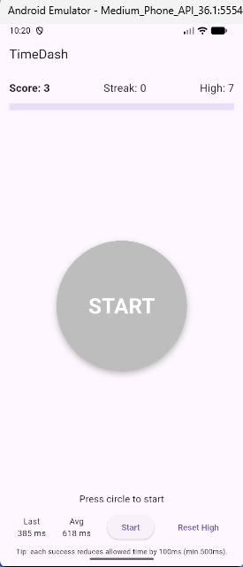
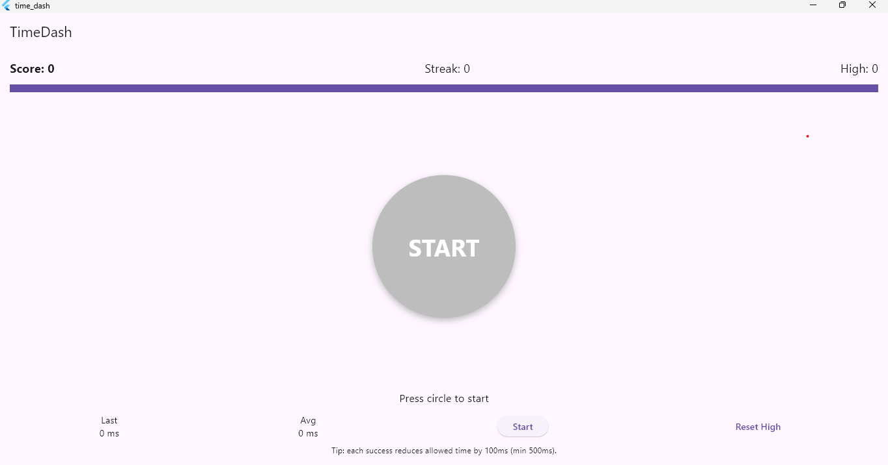

# 🕹️ TimeDash

**TimeDash** is a fast paced reaction mini game built using Flutter for Mobile, Web, and Windows.

## 🎯 Concept
Tap the circle before the shrinking progress bar runs out.  
Each success reduces the allowed time, testing your reaction speed and focus.

## 🧠 Features
- Animated progress bar and tap effects  
- Adaptive difficulty  
- Tracks score, streaks, and average reaction  
- Works on Android, Web, and Windows

## 🧩 Tech Stack
- Flutter (single codebase for all platforms)  
- `AnimationController` for timing logic  
- `GestureDetector` + `AnimatedScale` for interactivity

## 🖥️ Screenshots
| Platform | Screenshot |
|-----------|-------------|
| Mobile |  |
| Web | .png) |
| Windows |  |

## 🎬 Gameplay Clips
[Watch Gameplay Clip](run_proofs/android_clip.mp4)
[Watch Gameplay Clip](run_proofs/web(chrome)_clip.mp4)
[Watch Gameplay Clip](run_proofs/windows_clip.mp4)
